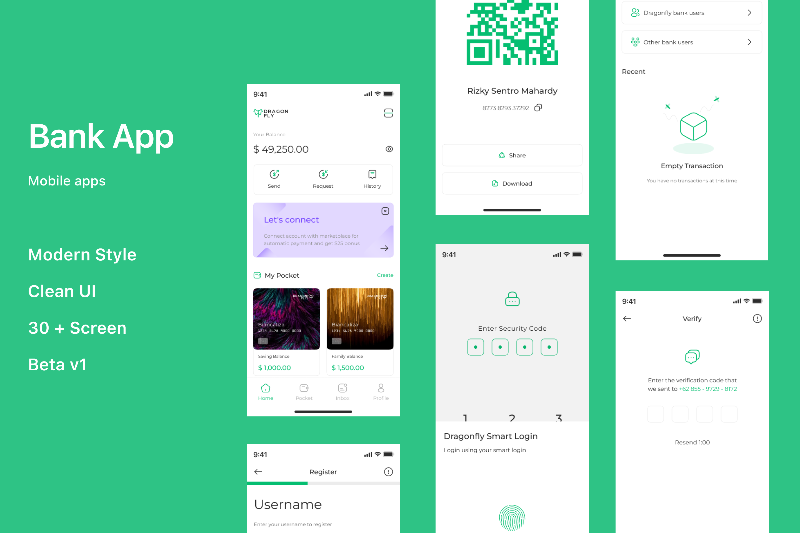

# dragonfly

Mobile Banking App (Concept)

## Things have I implemented?
1. Material 3
2. Use of Stateless and Stateful Widget
3. Implicit Animation
3. PageView
4. GridView
5. Navigator and Navigation Bar
6. Table
7. TabBar and TabController

Shoutout to <a href="https://www.figma.com/@rizkysentro">designer</a> for the UI Kit: <a href="https://www.figma.com/community/file/1259827886723480385/mobile-app-banking-mobile-app">Click Here</a>

